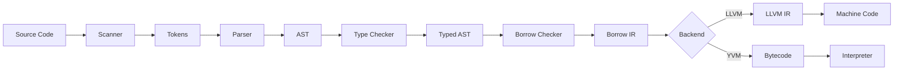

## Overview

Yoyo's compilation pipeline transforms source code into executable machine code or bytecode through multiple distinct phases. Each phase validates correctness and transforms the representation:



<Note>
All phases run at compile-time. Yoyo has **zero runtime overhead** for memory safety checks.
</Note>

## Phase 1: Lexical Analysis

### Scanner

The scanner (`src/yoyo/scanner.cpp`) converts source text into tokens:

```cpp
class Scanner {
    const char* start;    // Start of current token
    const char* current;  // Current character
    size_t line;          // Current line number
public:
    Token scanToken();
    bool isAtEnd() const { return *current == '\0'; }
};
```

### Token Structure

```cpp
struct Token {
    TokenType type;       // Identifier, Number, String, etc.
    std::string_view text; // Original text
    SourceLocation location; // File, line, column
};

enum class TokenType {
    // Literals
    Integer, Float, String, True, False, Null,
    
    // Keywords
    Let, Fn, Class, Interface, Impl, Return,
    If, Else, While, For, Break, Continue,
    
    // Operators
    Plus, Minus, Star, Slash, Percent,
    Equal, EqualEqual, BangEqual,
    Less, LessEqual, Greater, GreaterEqual,
    And, Or, Ampersand, Pipe,
    
    // Delimiters
    LeftParen, RightParen, LeftBrace, RightBrace,
    LeftBracket, RightBracket,
    Comma, Dot, Colon, Semicolon, Arrow,
    
    // Special
    Identifier, Eof, Error
};
```

### Example

<CodeGroup>
```yoyo Source
fn add(x: i32, y: i32) -> i32 {
    return x + y;
}
```

```text Tokens
Fn          "fn"        (1, 1)
Identifier  "add"       (1, 4)
LeftParen   "("         (1, 7)
Identifier  "x"         (1, 8)
Colon       ":"         (1, 9)
Identifier  "i32"       (1, 11)
Comma       ","         (1, 14)
Identifier  "y"         (1, 16)
Colon       ":"         (1, 17)
Identifier  "i32"       (1, 19)
RightParen  ")"         (1, 22)
Arrow       "->"        (1, 24)
Identifier  "i32"       (1, 27)
LeftBrace   "{"         (1, 31)
Return      "return"    (2, 5)
Identifier  "x"         (2, 12)
Plus        "+"         (2, 14)
Identifier  "y"         (2, 16)
Semicolon   ";"         (2, 17)
RightBrace  "}"         (3, 1)
Eof         ""          (3, 2)
```
</CodeGroup>

## Phase 2: Parsing

### Pratt Parser

Yoyo uses a **Pratt parser** (operator precedence parser) for expressions:

```cpp
class Parser {
    std::vector<Token> tokens;
    size_t current = 0;
    
    // Parselets for prefix expressions (literals, unary ops)
    std::unordered_map<TokenType, std::unique_ptr<PrefixParselet>> prefix_parselets;
    
    // Parselets for infix expressions (binary ops, calls)
    std::unordered_map<TokenType, std::unique_ptr<InfixParselet>> infix_parselets;
    
public:
    std::unique_ptr<Expression> parseExpression(int precedence);
    std::unique_ptr<Statement> parseStatement();
};
```

### Precedence Levels

```cpp
enum class Precedence {
    None = 0,
    Assignment = 1,   // =
    Or = 2,           // ||
    And = 3,          // &&
    Equality = 4,     // == !=
    Comparison = 5,   // < > <= >=
    BitwiseOr = 6,    // |
    BitwiseXor = 7,   // ^
    BitwiseAnd = 8,   // &
    Shift = 9,        // << >>
    Term = 10,        // + -
    Factor = 11,      // * / %
    Unary = 12,       // ! - &
    Call = 13,        // () [] .
    Primary = 14      // literals, identifiers
};
```

### AST Structure

<AccordionGroup>
<Accordion title="Statements">

```cpp
class Statement {
public:
    SourceLocation location;
    virtual ~Statement() = default;
};

class FunctionDeclaration : public Statement {
public:
    std::string name;
    FunctionSignature signature;
    std::vector<std::unique_ptr<Statement>> body;
};

class VariableDeclaration : public Statement {
public:
    std::string name;
    std::optional<Type> explicit_type;
    std::unique_ptr<Expression> initializer;
};

class WhileStatement : public Statement {
public:
    std::unique_ptr<Expression> condition;
    std::vector<std::unique_ptr<Statement>> body;
};
```
</Accordion>

<Accordion title="Expressions">

```cpp
class Expression : public ASTNode {
public:
    Type inferred_type;  // Filled by type checker
};

class IntegerLiteral : public Expression {
public:
    int64_t value;
    bool is_negative;
};

class BinaryOperation : public Expression {
public:
    std::unique_ptr<Expression> left;
    std::unique_ptr<Expression> right;
    TokenType op;  // +, -, *, etc.
};

class CallOperation : public Expression {
public:
    std::unique_ptr<Expression> callee;
    std::vector<std::unique_ptr<Expression>> arguments;
};
```
</Accordion>

<Accordion title="Types">

```cpp
struct Type {
    std::string name;           // "i32", "Vec", "&str"
    std::vector<Type> params;   // For generics: Vec<i32>
    
    bool is_type_var() const { return name.starts_with("?"); }
    bool is_reference() const { return name.starts_with("&"); }
    bool is_owning() const;
    
    std::string full_name() const {
        if (params.empty()) return name;
        std::string result = name + "<";
        for (size_t i = 0; i < params.size(); i++) {
            if (i > 0) result += ", ";
            result += params[i].full_name();
        }
        result += ">";
        return result;
    }
};
```
</Accordion>
</AccordionGroup>

### Parsing Example

<CodeGroup>
```text Expression
x + y * 2
```

```text Parse Tree
BinaryOperation(+)
├─ NameExpression("x")
└─ BinaryOperation(*)
   ├─ NameExpression("y")
   └─ IntegerLiteral(2)
```
</CodeGroup>

The parser respects precedence: `*` binds tighter than `+`.

## Phase 3: Type Checking

### Constraint Generation

The type checker traverses the AST and generates constraints:

```cpp
struct TypeCheckerState {
    std::vector<TypeCheckerConstraint> constraints;
    UnificationTable tbl;  // Union-find for type variables
    Type return_type;      // Expected return type
    
    Type new_type_var();   // Create fresh ?0, ?1, etc.
    void add_constraint(TypeCheckerConstraint);
    void unify_types(const Type&, const Type&, IRGenerator*);
};
```

### Type Inference Flow

<Steps>
<Step title="Generate Constraints">

Walk the AST and create constraints:

```cpp
TypeChecker checker{irgen, state};

for (auto& stmt : function->body) {
    std::visit(checker, stmt->get_variant());
}

// Constraints are now in state->constraints
```
</Step>

<Step title="Solve Constraints">

Iteratively process constraints:

```cpp
while (!state->constraints.empty()) {
    ConstraintSolver solver{irgen, state};
    
    std::vector<TypeCheckerConstraint> unsolved;
    for (auto& constraint : state->constraints) {
        bool satisfied = std::visit(solver, constraint);
        if (!satisfied) unsolved.push_back(constraint);
    }
    
    state->constraints = std::move(unsolved);
    
    if (solver.has_error) break;
}
```
</Step>

<Step title="Substitute Solutions">

Replace type variables with concrete types:

```cpp
Type TypeCheckerState::best_repr(const Type& ty) {
    if (!ty.is_type_var()) return ty;
    
    uint32_t root = tbl.find(tbl.type_to_id(ty));
    Domain* dom = tbl.domain_of(root);
    
    if (dom->is_solved())
        return dom->get_solution();
    
    return tbl.id_to_type(root);
}
```
</Step>

<Step title="Annotate AST">

Write inferred types back to AST nodes:

```cpp
for (auto& expr : all_expressions) {
    expr->inferred_type = state->best_repr(expr->inferred_type);
}
```
</Step>
</Steps>

### Example

<CodeGroup>
```yoyo Code
fn example() {
    let x = 42;        // Infer i32
    let y = x + 10;    // Also i32
    let z = [x, y];    // Vec<i32>
}
```

```text Constraints
1. ?0 = integer type             (from 42)
2. ?0 can store 42               (range check)
3. ?1 = ?0                       (from x + 10)
4. ?0 + i32 -> ?1                (binary op)
5. ?2 = Vec<?3>                  (array literal)
6. ?3 = ?0                       (array element)
7. ?3 = ?1                       (array element)

Solution:
  ?0 = i32
  ?1 = i32
  ?2 = Vec<i32>
  ?3 = i32
```
</CodeGroup>

## Phase 4: Borrow Checking

### IR Generation

Convert typed AST to borrow checker IR:

```cpp
struct DomainCheckerState {
    BorrowCheckerFunction* func;  // CFG with basic blocks
    ValueTypeMapping type_mapping; // SSA values -> types
    PointsToGraph ptgraph;         // Alias analysis
    
    std::unique_ptr<BorrowCheckerFunction> check_function(
        FunctionDeclaration* decl,
        IRGenerator* irgen,
        const FunctionSignature& sig,
        TypeCheckerState* stt
    );
};
```

### Borrow Checking Pipeline

<Steps>
<Step title="Build CFG">

Generate basic blocks with ownership instructions:

```cpp
BorrowCheckerEmitter emitter(irgen, type_state, func, entry_block);

for (auto& stmt : decl->body) {
    std::visit(emitter, stmt->get_variant());
}

// func now contains basic blocks with instructions
```
</Step>

<Step title="SSA Transformation">

Convert to Single Static Assignment:

```cpp
state->transform_to_ssa();

// Inserts PhiInstruction at merge points
// Renames all variables to unique SSA names
```
</Step>

<Step title="Domain Insertion">

Add domain constraints:

```cpp
for (auto& block : func->blocks) {
    DomainVariableInserter inserter{state, block->instructions};
    
    for (auto& inst : block->instructions) {
        std::visit(inserter, inst->to_variant());
    }
}

// Instructions now have DomainSubsetConstraint, etc.
```
</Step>

<Step title="Points-To Analysis">

Build alias graph:

```cpp
state->do_primary_analysis();

// Computes what each domain might point to
// Used to determine when moves invalidate references
```
</Step>

<Step title="Dataflow Analysis">

Compute live domains:

```cpp
state->do_domain_validity_analysis(entry_block);

// For each instruction, tracks which domains are valid
// Stored in state->dfa_in and state->dfa_out
```
</Step>

<Step title="Verification">

Check all dereferences are safe:

```cpp
BorrowCheckVisitor visitor{state, irgen};

for (auto& block : func->blocks) {
    for (auto& inst : block->instructions) {
        std::visit(visitor, inst.get());
    }
}

// Errors if dereferencing an invalidated domain
```
</Step>
</Steps>

### Example IR

<CodeGroup>
```yoyo Source
fn consume(x: Vec<i32>) {
    let y = x;  // Move
    print(x);   // ERROR: use after move
}
```

```text Borrow Checker IR
block_entry:
    %x0 = arg(0) : Vec<i32>  // Parameter
    relocate %x0 into %y0    // Move
    call print(%x0)          // Use after move!
    ret void
```

```text Dataflow Analysis
Instruction               | dfa_in          | dfa_out
--------------------------|-----------------|---------
%x0 = arg(0)             | {}              | {%x0}
relocate %x0 into %y0    | {%x0}           | {%y0}
call print(%x0)          | {%y0}           | ERROR!
```
</CodeGroup>

The borrow checker detects that `%x0` is not in `dfa_in` at the `call` instruction.

## Phase 5: Code Generation

### Backend Selection

Depending on the chosen backend:

<Tabs>
<Tab title="LLVM Backend">

Generate LLVM IR:

```cpp
LLVMIRGenerator irgen(llvm_context);
irgen.GenerateIR("main", statements, module, engine);

// Produces LLVM IR:
llvm::Module* llvm_mod = irgen.code;

// Optimize:
optimize_module(llvm_mod);

// JIT compile:
llvm::orc::ThreadSafeModule tsm(std::move(llvm_mod), ...);
engine->addModule(std::move(tsm));
```

Example LLVM IR:

```llvm
define i32 @add(i32 %x, i32 %y) {
entry:
  %result = add i32 %x, %y
  ret i32 %result
}
```
</Tab>

<Tab title="YVM Backend">

Generate bytecode:

```cpp
YVMIRGenerator irgen;
irgen.GenerateIR("main", statements, module, engine);

// Produces bytecode:
Yvm::Module* bytecode = irgen.code;

// Execute:
Yvm::VM vm(bytecode);
vm.call_function("main", args);
```

Example bytecode:

```text
function add:
  load_local 0    ; Load x
  load_local 1    ; Load y
  add_i32         ; Add
  return_value    ; Return result
```
</Tab>
</Tabs>

### Optimization Passes

<AccordionGroup>
<Accordion title="LLVM Optimizations">

```cpp
void optimize_module(llvm::Module* mod) {
    llvm::PassManagerBuilder pm_builder;
    pm_builder.OptLevel = 2;  // -O2
    pm_builder.SizeLevel = 0;
    pm_builder.Inliner = llvm::createFunctionInliningPass();
    
    llvm::legacy::PassManager pm;
    pm_builder.populateModulePassManager(pm);
    pm.run(*mod);
}
```

Passes include:
- Function inlining
- Dead code elimination
- Constant folding
- Loop optimization
- Register allocation
</Accordion>

<Accordion title="YVM Optimizations">

```cpp
void optimize_bytecode(Yvm::Module* mod) {
    // Peephole optimizations
    remove_redundant_loads(mod);
    fold_constants(mod);
    
    // Stack optimizations
    eliminate_dead_stores(mod);
    merge_basic_blocks(mod);
}
```

Simpler than LLVM but still effective:
- Constant propagation
- Dead store elimination
- Jump threading
</Accordion>
</AccordionGroup>

## Complete Example

Let's trace a complete compilation:

<CodeGroup>
```yoyo Source Code
fn factorial(n: i32) -> i32 {
    if n <= 1 {
        return 1;
    }
    return n * factorial(n - 1);
}
```

```text Phase 1: Tokens
Fn Identifier("factorial") LeftParen
Identifier("n") Colon Identifier("i32") RightParen
Arrow Identifier("i32") LeftBrace
If Identifier("n") LessEqual Integer(1) LeftBrace
Return Integer(1) Semicolon RightBrace
Return Identifier("n") Star Identifier("factorial")
LeftParen Identifier("n") Minus Integer(1) RightParen
Semicolon RightBrace Eof
```

```text Phase 2: AST
FunctionDeclaration
  name: "factorial"
  params: [("n", Type{"i32"})]
  return_type: Type{"i32"}
  body:
    - IfExpression
        condition: BinaryOp(<=, Name("n"), IntLit(1))
        then:
          - ReturnStatement(IntLit(1))
    - ReturnStatement(
        BinaryOp(*,
          Name("n"),
          Call(Name("factorial"),
               [BinaryOp(-, Name("n"), IntLit(1))])
        )
      )
```

```text Phase 3: Type Checking
Constraints:
  1. n : i32 (given)
  2. 1 : integer, can store 1
  3. n <= 1 : bool
  4. n * ?0 : i32 (from return type)
  5. factorial : Fn(i32) -> i32
  6. n - 1 : i32
  
Solution: All constraints satisfied ✓
```

```text Phase 4: Borrow Checker IR
block_entry:
  %n0 = arg(0) : i32
  %cond = cmp_le %n0, 1
  condbr %cond [block_then, block_else]

block_then:
  ret 1

block_else:
  %n_minus_1 = sub %n0, 1
  %rec_result = call factorial(%n_minus_1)
  %result = mul %n0, %rec_result
  ret %result
```

```llvm Phase 5a: LLVM IR
define i32 @factorial(i32 %n) {
entry:
  %cmp = icmp sle i32 %n, 1
  br i1 %cmp, label %then, label %else

then:
  ret i32 1

else:
  %n_minus_1 = sub i32 %n, 1
  %rec = call i32 @factorial(i32 %n_minus_1)
  %result = mul i32 %n, %rec
  ret i32 %result
}
```

```text Phase 5b: YVM Bytecode
function factorial:
  load_local 0        ; n
  push_i32 1
  cmp_le_i32
  jump_if_false else
then:
  push_i32 1
  return_value
else:
  load_local 0        ; n
  load_local 0        ; n
  push_i32 1
  sub_i32             ; n - 1
  call factorial 1    ; factorial(n-1)
  mul_i32             ; n * rec
  return_value
```
</CodeGroup>

## Performance Metrics

<CardGroup cols={2}>
<Card title="Scanning" icon="bolt">
~1 MB/s per core. Very fast, limited by memory bandwidth.
</Card>

<Card title="Parsing" icon="code">
~500 KB/s. Pratt parser is efficient but creates many allocations.
</Card>

<Card title="Type Checking" icon="diagram-project">
~200 KB/s. Constraint solving dominates. Union-find is fast but cache-unfriendly.
</Card>

<Card title="Borrow Checking" icon="shield-check">
~100 KB/s. Most expensive phase. SSA and dataflow analysis are costly.
</Card>

<Card title="LLVM Codegen" icon="microchip">
~50 KB/s. LLVM optimization passes are slow but produce excellent code.
</Card>

<Card title="YVM Codegen" icon="gauge-high">
~500 KB/s. Much faster than LLVM. Minimal optimization.
</Card>
</CardGroup>

## Error Recovery

Each phase reports errors but continues when possible:

<Tabs>
<Tab title="Scanner Errors">

```text
error: unterminated string literal
  --> main.yy:3:10
   |
 3 | let s = "hello
   |          ^^^^^^ string not closed
```
</Tab>

<Tab title="Parser Errors">

```text
error: expected ';' after statement
  --> main.yy:4:15
   |
 4 | let x = 42
   |           ^ insert ';' here
```
</Tab>

<Tab title="Type Errors">

```text
error: type mismatch
  --> main.yy:5:10
   |
 5 | let y: i32 = "hello";
   |              ^^^^^^^ expected i32, found &str
```
</Tab>

<Tab title="Borrow Errors">

```text
error: use of moved value 'x'
  --> main.yy:7:10
   |
 5 | let y = x;
   |         - value moved here
 6 |
 7 | print(x);
   |       ^ value used after move
```
</Tab>
</Tabs>

## Key Files

<CodeGroup>
```text Frontend
src/yoyo/scanner.cpp        - Lexical analysis
src/yoyo/parser.cpp         - Syntax analysis
src/yoyo/parselets/         - Pratt parser parselets
include/yoyo/token.h        - Token definitions
include/yoyo/statement.h    - AST node declarations
```

```text Semantic Analysis
src/yoyo/type_checker.cpp   - Type inference
src/yoyo/borrow_checker.cpp - Memory safety
include/yoyo/type_checker.h - Constraint types
include/yoyo/borrow_checker.h - IR definitions
```

```text Backend
src/yoyo/llvm/ir_gen.cpp    - LLVM code generation
src/yoyo/yvm/ir_gen.cpp     - YVM code generation
include/yoyo/llvm/llvm_irgen.h
include/yoyo/yvm/yvm_irgen.h
```
</CodeGroup>

## Further Reading

<CardGroup cols={2}>
<Card title="Type System" href="/advanced/type-system" icon="diagram-project">
Constraint-based type inference
</Card>

<Card title="Borrow Checker" href="/advanced/borrow-checker" icon="shield-check">
Memory safety verification
</Card>

<Card title="Backends" href="/advanced/backends" icon="microchip">
LLVM vs YVM execution
</Card>

<Card title="Language Guide" href="/language/syntax" icon="book">
Yoyo language features
</Card>
</CardGroup>